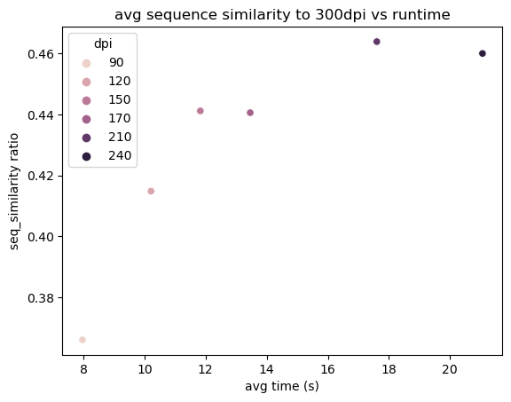
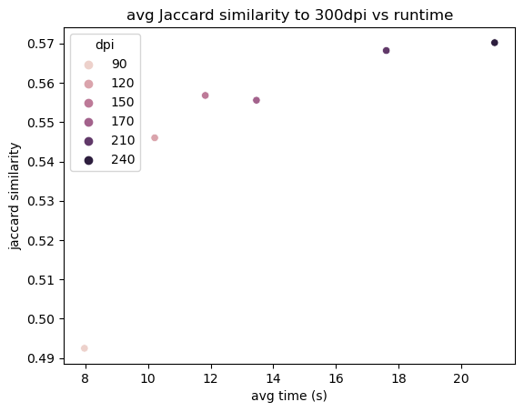

# Research Findings
We put together this page in order to pass along the flow of research to future cohorts and present findings on why specific technologies were selected over others.

## Box API

## Tesseract
For this project, we are using [PyTesseract](https://pypi.org/project/pytesseract/), a wrapper designed for work with Google's [Tesseract](https://opensource.google/projects/tesseract) OCR Engine. Research into Tesseract functionality has included use cases with [cv2](https://www.pyimagesearch.com/2017/07/10/using-tesseract-ocr-python/) for better image blur detection. We eventually dismissed this notion as it was deemed unneccessary for our project needs.

### Image dpi Setting Analysis
TLDR: Based on our analysis we recommend a dpi setting of 120 to 150.

The dpi kwarg of the pdf2image.convert_from_bytes() allows us to set the resolution of images input to the Tesseract ocr. Higher resolutions produce better results, but the time cost of running Tesseract on higher resolution images is severe. Given the large volume of documents we need to convert, we conducted an analysis to determine a dpi setting that balances ocr results quality and time cost. We selected 12 pdfs from the 'National archive docs' repo, more or less at random, ran each of them through OCR at 300 dpi as well as 90, 120, 150, 170, 210 and 240 dpi. We then found similarity measures between the 300 dpi results and each of the lower dpi ocr results for each document.

The table below shows the average time in seconds, and similarity to the 300 dpi ocr results for each dpi setting.

|     | bytes_size | time_low(s) | sequence_similarity ratio | Jaccard similarity |
|----:|-----------:|------------:|--------------------------:|-------------------:|
| dpi |            |             |                           |                    |
|  90 | 1134752.5  | 7.970000    | 0.365983                  | 0.492492           |
| 120 | 1134752.5  | 10.212500   | 0.414800                  | 0.546017           |
| 150 | 1134752.5  | 11.827500   | 0.441150                  | 0.556783           |
| 170 | 1134752.5  | 13.460000   | 0.440558                  | 0.555567           |
| 210 | 1134752.5  | 17.604167   | 0.463892                  | 0.568200           |
| 240 | 1134752.5  | 21.062500   | 0.460017                  | 0.570200           |

Plots of the information contained in the table above:

We get a ~10% jump in similarity to 300dpi moving from 90 to 120 dpi with only a ~25% increase in time cost, and another ~5% bump in similarity moving to 150dpi at a ~50% increase in time cost compared to 90dpi. Beyond 150 dpi, time cost increases dramatically with little increase in similarity. Similarity to 300dpi is not an excellent measure of results quality, however, given we do not have 'true' validation documents to compare-to in order to determine actual text accuracy, this might be the best we can do without manually typing out a set of validation documents.

## FastAPI

## MongoDB
[MongoDB](https://www.mongodb.com/) was chosen as the database housing for this project. [Here](https://github.com/Lambda-School-Labs/human-rights-first-docdb-ds/blob/feature/mongo_population_research/assets/mongo_population_research.md) you can find the research our team has completed about this library.

## NER
[SpaCy](https://spacy.io/) offers pretrained models for Named Entity Recognition. But the key terms most pertinent to our stakeholder are not necessarily recognized by generic models.
- [Prodigy](https://prodi.gy/) is a tool for building custom NER datasets.
- Annotation is always labor-intensive, but prodigy could work well for us, or for the researchers themselves, if our app somehow exposes this functionality to the end user. See [this video for a walkthrough](https://www.youtube.com/watch?v=59BKHO_xBPA).

## Generating document summaries and previews
Automated document summaries come in many forms.
- For background, check out [these Stanford lecture slides](http://web.stanford.edu/class/cs276b/handouts/lecture14.pdf).
- *Abstractive summaries* capture the gist of a document in a sentence or two.
  - Automatic summaries of this type are tough to generate; until ~2017, training a neural network for this task required *labeled examples* from real people reading articles and writing summaries.
  - In 2020, researchers at Google Brain and Imperial College London adapted SpanBERT's *unsupervised training* to whole sentences, then optimized all they could: [Pre-training with Extracted Gap-sentences for Abstractive Summarization](https://arxiv.org/pdf/1912.08777.pdf); [Google's AI blog](https://ai.googleblog.com/2020/06/pegasus-state-of-art-model-for.html).
    - **Model checkpoints and instructions are in [this repo](https://github.com/google-research/pegasus).**
    - Fine-tune on 1,000 documents to generate state-of-the-art summaries on 100,000 documents.
    - Insert summaries to the DB offline, then serve up relevant documents' links along with brief summaries.
- *Query-specific summaries* are less like summaries and more like previews.
  - Documents deemed relevant to a query presumably contain words identical or nearly identical to the user's search terms; a query-specific summary is an excerpt that contains those relevant terms in their surrounding context.
  - By definition, these excerpts are undefined until the Front End calls the DS API with search terms.
  - **[Mongo's built-in function](https://docs.atlas.mongodb.com/reference/atlas-search/highlighting/#std-label-highlight-ref) is probably our best bet**, but we will need custom code for this, too.
  - If targeted excerpts are too difficult, we could pinpoint any Named Entities or Tags that jibe with search terms.

## Future Research
- Tags:
  Extracting tags could be achieved by vectorization (TFIDF, CountVectorizer or SpaCy) of documents.